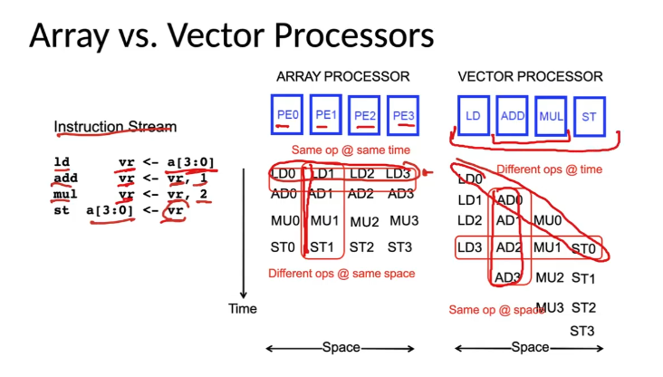

il parallelismo a livello di dati è più semplice ed efficente

- sia logicamente
- che nell'implementazione
  - se devo fare la stessa istruzione su più dati: con DLP posso avere un'unico stadio di fetch seguito da molteplici functional unit
  - con TLP avrei dovuto replicare il core
  - con ILP dovevo implementare tutta la logica di Tommasulo, con DLP me la posso dimenticare
- ma meno flessibile

in DLP non c'è dipendenza a livello di dati

**NB**: per sfruttare DLP c'è bisogno che il codice abbia dei loop lunghi

# 3 modi principali per sfruttare parallelismo a livello di dati

## VLIW (very long instruction word)

microarchitetture in cui all'interno del singolo ciclo è possibile eseguire più istruzioni

- versione più semplice delle architetture superscalari
- qua abbiamo più unità functionali
- condividiamo lo stesso register file
- è compito del compilatore decidere quale istruzione esegue in quale momento

Il difetto di queste architetture (come per le architetture superscalari) è che abbiamo dei **registri scalari**

- quindi, anche se abbiamo più unità funzionali in cui mettere in esecuzioni più istruzioni in parallelo, siamo limitati dalla dimensione dei registri
- per non avere conflitti dobbiamo fare riferimento a registri diversi nel RF

**NB**: Due ingredienti che abilitano DLP

- una rivisitazione delle FU per permettere l'esecuzione di più operazioni
- un'estensione del RF che permette di ospitare più dati

## Architetture SIMD (o array processor)

abbiamo

- un nuovo set di istruzioni
- un RF dedicato a queste istruzioni che ha un parallelismo molto più alto
- un numero di functional unit dello stesso tipo moltiplicato che possono eseguire più calcoli in parallelo

la logica SIMD ha un grosso difetto:

- se passiamo, ad esempio, da SIMD 256 a 512 sono due instruction set diversi
- SIMD 256 fa riferimento ad un RF ed ha un encoding delle istruzioni diverso rispetto a SIMD 512

## vector processor

gli array processor eseguono la stessa istruzioni su dati molteplici utilizzando altrettante FU

i vector processor operano sempre su dati molteplici, tuttavia non eseguono tutto in unica botta, piuttosto in passi successivi e sullo stesso hardware

- spalmiamo nel tempo i dati di più operazioni sulla stessa FU
- abbiamo come nel caso di array processor un RF più grande ma le FU non vengono moltiplicate
- simile ad una pipeline

La logica vettoriale scorre il registro esteso dando in pasto alla functional unit un elemento alla volta



```Chatgpt
Vector processor sono comunque categorizzabili come DLP?

Si, perché una singola istruzione genera l’elaborazione di molti elementi in modo automatico, senza loop o controllo esplicito.

✖ Non è parallelo spaziale

Con una sola lane NON stai facendo addizioni “contemporaneamente” come in un array processor.

Ma il parallelismo dei dati NON significa necessariamente “molti risultati nello stesso ciclo”, significa:

“Una singola istruzione attiva la stessa operazione su molti dati diversi.”

E questo è esattamente il caso delle istruzioni vettoriali.
```

# Array vs Vector processor

OSS: le architetture che sfruttano DLP sono più efficaci rispetto ad architetture scalari dato che

- riducono il numero di istruzioni di cui bisogna fare fetch e decode per un blocco di dati
  - meno accessi alla memoria e meno consumo energetico
- inoltre riducono le istruzioni di controllo per i cicli

Con una architettura scalare le istruzioni di controllo possono causare un sottoutilizzo delle unità funzionali della pipeline (non riusciamo a tenerle piene se non con Tommasulo e ROB).

...

Con array processor ho comunque istruzioni di controllo, mentre **con vector processor queste scompaiono** (a patto che il vector register sia abbastanza lungo)

Vector processor in generale impiegano più cicli rispetto ad array processor

- prevedibile, abbiamo solo una functional unit come nel caso scalare
- tuttavia siamo più efficenti dato che paghiamo cicli solo per fare lavoro utile e non per istruzioni di controllo

**Vector chaining**

Mentre nel caso di array processor possiamo eseguire una istruzione successiva solo quando quella precedente ha terminato.

Nel caso di vector processor possiamo incominciare ad eseguire l'istruzione successiva appena i primi operandi sono disponibili

Conclusione: vedi slide 20

# Architetture vettoriali moderne

combinano array e vector processor

- utilizziamo sempre la stessa idea di scorrere l'array dei vector processor
- ma adesso aggiungiamo più functional unit in modo tale da scorrere con uno stride più grande e computando più dati nello stesso passo
  - adesso abbiamo più lane

# Terminologia

- XRF, FRF, VRF -> integer(scalar) RF, float RF, vector RF
- SEW           -> single element width
- XLEN          -> scalar register length
- VLEN          -> vector register length
- VLMAX         -> numero di elementi max del registro vettoriale (implementazione diverse della stessa ISA possono avere VLMAX diversi, quindi il codice deve controllare questo parametro)
- VL            -> application vector length; la lunghezza effettiva del RF che il nostro codice utilizza
- LMUL          -> register grouping multiple; laddove il codice non abbia bisogno di utilizzare tutti i registri del RF, può compattare insieme più registri per ottenerne uno più lungo

# Lane

una lane è:

- una porzione di VRF
- un gruppo di functional unit che permettono di svolgere tutte le operazione dell'instruction set
