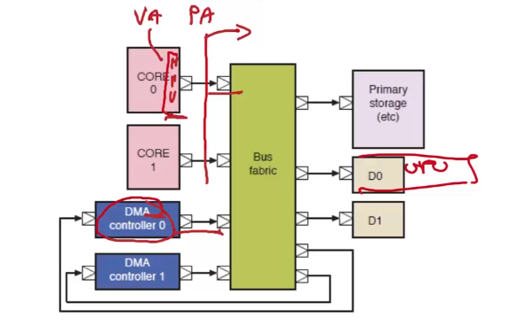

due possibili tipologie di periferiche

- on chip
- esterne

# Architettura vista in triennale

abbiamo due bus tristate

- tutti gli attori del sistema sono collegati a questi bus
- ricorda che la logica tristate serve ad ottenere mutua esclusione (delle scritture) su un bus condiviso

chi ha il diritto di comunicare (tipicamente il processore) emette l'indirizzo desiderato sul bus degli indirizzi

- abbiamo dei write enable/read enable e una logica di chip select che mi abilita il dispositivo responsabile dell'indirizzo emesso

e un data bus su cui circolano i dati da leggere/scrivere verso/da chi ha messo l'indirizzo (il processore)

Questo tipo di interconnessione ha senso su una motherboard in cui si ha scarsità di fili metallici disponibili

- questo giustifica anche la necessità dei buffer tristate che sono onerosi in termini di area e consumo di potenza

# Architetture di interconnessione moderne

Nella logica odierna, sopratutto se siamo on-chip

- di fili ne abbiamo quanti ce ne pare
- sostituiamo il singolo bus con delle porte di lettura e delle porte di scrittura
  - abbiamo un bus dedicato per leggere e scrivere
  - utilizziamo dei protocolli di comunicazione e delle matrici di interconnessione tra i vari dispositivi (crossbar/switch)
  - questo elimina la logica tristate

## Protocolli di comunicazione

Il bus tristate era asincrono

- le letture/scritture avvenivano fino a che i segnali di controllo venivano mantenuti alti

Passiamo oggi a dei protocolli di comunicazione sincroni (condividono un segnale di clock)

- ora la lettura/scrittura da un iniziatore di comunicazione verso un dispositivo target, avviene sul fronte di salita del segnale di clock

Abbiamo sempre un protocollo di handshake che sincronizza i due comunicanti

- l'iniziatore comanda tre segnali
  - un segnale di indirizzo che specifica con chi vuole avere la comunicazione
  - due segnali di controllo:
    - hren -> richiesta di lettura
    - hwen -> richiesta di scrittura
- il dispositivo target risponde alle richieste quando gli pare asserendo un segnale di ack
- quando su un fronte di salita del clock sia l'ack che il segnale di richiesta sono entrambi alti, la comunicazione avviene (vengono scambiati i dati)

**NB**: anche dal diagramma si nota come adesso non abbiamo più un bus tristate, piuttosto abbiamo **un canale di lettura e un canale di scrittura per ogni dispositivo capace di iniziare una comunicazione**.

- guarda slide 4

**NB**: la cosa importante rispetto a prima è che ora tutti, sia i canali che i segnali hanno una direzione, non sono più bidirezionali

- meno costo e latenza; più canali

## Come facciamo a connettere un iniziatore a più target? | Matrici di interconnessione

i canali address e wd dell'iniziatore vengono collegati a tutti i possibili dispositivi target

i canali rd dei dispositivi target vengono dati in pasto ad un mux. lo stesso avviene anche per gli ack

abbiamo un dispostivo che gestisce la logica di decode

- riceve in ingresso hwen, hren e address
- in base all'indirizzo emesso dall'iniziatore, il decoder asserirà i segnali di controllo relativi solamente al dispositivo target giusto

### Se voglio più iniziatori?

similmente al multiplexer che serviva per i dispositivi target

ora aggiungo dei multiplexer per i vari segnali degli iniziatori

Abbiamo poi un **bus arbiter**

- gli arrivano le richieste di lettura/scrittura dai vari dispositivi iniziatori e ...
- questo decide in un determinato momento chi è l'iniziatore connesso ai vari bus (chi è che comanda la transazione di lettura/scrittura)
- controlla i multiplexer dei dispositivi iniziatori

**NB**: con questo tipo di matrice di interconnessione in un determinato istante, possiamo avere al massimo un solo dispositivo iniziatore che comunica con un solo dispositivo target. Questo siccome stiamo comunque condividendo i bus di (addr, wd, rd)... situazione simile a tristate bus

## Crossbar

Come possiamo incrementare la banda permettendo a dispositivi indipendenti di comunicare contemporaneamente?

- utilizziamo ancora più fili e duplichiamo i vari multiplexer
- in questa maniera non c'è più condivisione di un bus
- l'arbitro controlla le collissioni e serializza in caso avvengano
- questa è una crossbar

(quella che abbiamo visto prima è una crossbar TDM)

# Interrupt controllers

(notare la sintassi delle porte;  -> = porta iniziatore, <- = porta target)

serializza più richieste di interrupt su un unico filo, e fornisce un indice che definisce quale dispositivo (filo, linea di interrupt) ha generato l'interrupt

...

PLIC == interrupt distributor

- permette di configurare a quale core inviare gli interrupt

generalmente troviamo due livelli di interrupt controller in un processore multicore

- interrupt controller interno al core
  - gestisce diverse linee di interrupt verso il singolo core
- plic / interrupt distributor / interrupt controller a livello di piattaforma
  - definisce il mapping tra periferiche e core
  - quali core gestiscono gli interrupt di quali periferiche

# DMA

come gestiamo i trasferimenti di memoria dalle periferiche verso la memoria?

Si potrebbe pensare inizialmente di far fare tutto al core che gestisce l'interrupt facendogli gestire la periferica direttamente:

- Nel caso di periferica di lettura, la periferiche che ha pronto un dato asserisce la sua linea di interrupt
- questo fa scattare l'handler di un core che va a leggere il dato
  - attiva il protocollo di lettura visto prima emettendo l'indirizzo del registro della periferica target contenente il dato
- il core si copia il dato letto in memoria in modo tale da renderlo disponibile al programma per poi fare quello che serve
- Nel caso di periferica di scrittura (scrive verso il mondo esterno), l'interrupt segnala al processore che il dato è stato propagato e che la periferica è disponibile a ricevere il prossimo

Il processore quindi:

- copia dati dalla periferica verso la memoria con periferiche di lettura
- copia dati dalla memoria verso la periferica con periferiche di scrittura
- in entrambi i casi il processore fa una lettura e una scrittura verso la memoria (un accesso per la periferica e uno verso la RAM)

Ma così **impiegamo tempo del processore per gestire la periferica**

- noi il processore lo vorremmo usare per fare conti
- non per trasferire dati tra periferica e memoria

Possiamo ovviare questo problema inserendo un controller che fa DMA

Questo dispostivo permette di gestire direttamente i trasferimenti dati tra periferica e memoria centrale. Senza coinvolgimento della CPU.

Il DMA controller è sia un iniziatore che target

- ha quindi una porta da iniziatore con cui avvia transazioni di lettura/scrittura verso i dispositivi che sono mappati in memoria
- e anche una porta da target con cui un processore può configurarlo

In aggiunta, il **DMA controller riceve anche segnali di interrupt** (può essere una destinazione del PLIC), e può generarli

- tipicamente le periferiche gestite con DMA emettono interrupt come prima
- stavolta però, invece di essere gestite dalla CPU vengono gestite dal DMA controller che si occupa dei trasferimenti

Il DMA alleggerisce la CPU dal trasferimento dati

- se devo lanciare un kernel su una GPU che processa una matrice da 1MB, il processore non copia la matrice nella GRAM, piuttosto questo compito viene delegato al DMA controller

# DMA e memoria virtuale

I core hanno una MMU che si occupa della traduzione e della protezione della memoria

il registro puntatore del DMA controller viene programmato con indirizzi virtuali del programma

- puntatori ad array o strutture dati più complicate
- se non facciamo niente il DMA controller emetterà indirizzi virtuali e questo non è corretto
- allo stesso modo se non faccio nulla, posso programmare il DMA per scrivere in qualunque porzione di memoria fisica dato che non c'è una MMU che controlla i bit di protezione

...

- il device driver eseguito dal core configurerà la periferica per eseguire determinate operazioni
- allo stesso tempo il device driver configurà anche il DMA controller per gestire i trasferimenti di dati tra memoria e periferica durante le attività di quest'ultima
- la periferica emetterà direttamente degli indirizzi fisici (come registro puntatore del DMA controller)
- se la periferica è stata configurata dal device driver con un VA, quest'ultima emettera il VA come PA e quindi accederà ad una regione di memoria sbagliata

Come prima soluzione si potrebbe pensare che il device driver può invece configurare la periferica fornendole direttamente la traduzione del VA (siamo in kernel space e quindi possiamo accedere alla page table dei processi)

- questa soluzione è onerosa
- non gestisce protezione (? a me sembra che si possa)

## IOMMU

adesso ogni periferica ha un componente hardware che fa da MMU per la periferica

questo permette heterogeneous compute

- i virtual address sono gli stessi dappertutto nel sistema dato che anche le periferica possono fare address translation
- posso programmare la GPU passandole un puntatore alla DRAM ed essa sarà in grado di lavorare direttamente senza copiare i dati nella sua VRAM
  - nella pratica continuo a fare trasferimenti espliciti dato che la VRAM ha una larghezza di banda molto più alta rispetto alla DRAM
  - usare la DRAM peggiorerebbe un sacco le performance

grazie alla IOMMU, IO can share CPU page tables

questo non significa avere memoria unificata!

- memoria unificata significa avere un'unica page table che gestisce sia le pagine della DRAM che della VRAM
